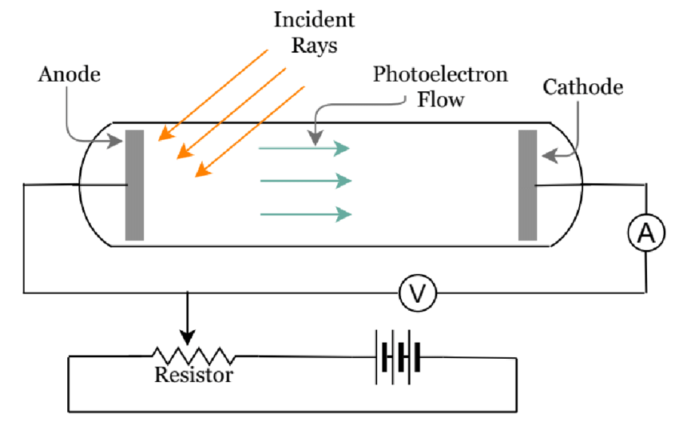

$\pagebreak$

# Radiacion de Cuerpo Negro

## Radiacion Termica

El espectro visible es un porcion infima del espectro de frecuencias. Por encima de espectro visible esta e infrarrojo, ondas cortas/argas, etc...

La radiacion termica es una radiacion electromagnetica. Si se tiene un material caliente, el calor produce agitacion de moleculas, que mueve cargas. Sabemos por Maxwell que esto produce radiacion electromagnetica. Se tienen estos osciladores que generan la radiacion electromagnetica.

La radiacion termica se caracteriza por tener un espectro continuo, para cada frecuencia una cierta intensidad de radiacion termica. Es fuertemente dependiente de la temperatura. Cuando calentamos algo y cambia su color, tiene que ver con la frecuencia a la que esta radiando.

Para caracterizarla matematicamente vamos a usar el concepto de...

## Radiancia Espectral ($e_f(T)$)

La radiancia espectral es la potencia emitida por unidad de area y por unidad de frecuencia para una dada temperatura del cuerpo radiante.

$$e_T(T) = \int_0^\infty e_{\lambda}(T) d\lambda$$

Esto es la potencia total por unidad de area. Se obtiene integrando en todas las longitudes de onda o frecuencias.

### Ley de Kirchoff

Asumiendo un cuerpo caliente en equilibrio termodinamico, la ley de Kirchoff nos dice que su emisividad $E_f$ es igual a su absortividad $A_f$.

_En equilibrio absorbe lo mismo que emite_

Tambien descubrio que la radiancia espectral se podia expresar como una sola funcion universal, pero no llego a encontrar la expresion

$$ e_f = J(f,T)A_f $$

Para el espectro de absorcion con $0 < A_f < 1$.

$$e_f = J(f, T)E_f$$

Para el espectro de emision, con $0 < E_f < 1$.

## Definicion de Cuerpo Negro

Un cuerpo negro se define como emisor y absorbedor idea. Matematicamente cumple que $A_f = E_f = 1$.

Cuerpo gris es aquel cuyos coeficientes son constantes, pero menores a uno.

### Ley de Stefan

Josef Stefan encontro que la potencia total radiada po unidad de area para un cuerpo negro corresponde a cierta ley

$$ e_t = \sigma T^4 $$.

Donde $\sigma = 5,67 \times 10^{-8} \frac{W}{m^2K^4}$ y $T$ es la temperatura absoluta en K.elvin

Si bien dijimos que los cuerpos negros son ideales, hay cuerpos que se pueden aproximar al comportamiento de un cuerpo negro. Por ejemplo, el Sol. Si esta ecuacion fuera para otro tipo de cuerpo con coeficientes no constantes, tendria que trabajar directamente desde la integral de radiancia espectral, ya que los coeficientes dependerian de la frecuencia.

### Ley de Desplazamiento de Wien

La ley de desplazamiento de Wien nos dice que la longitud maxima de radiancia espectral resulta inversamente proporcional a la temperatura.

{width=350px}

La expresion matematica de esta ley es

$$ \lambda _{max} T = 2,898 \times 10^{-3} mK $$

Lo que descubrio Wien es que el maximo de radianca espectral varia de tal manera que el producto de la temperatura y la longitud de onda es una constante. Por lo tanto, estas dos magnitudes son inversamente proporcionales.

## Densidad de Energia por Unidad de Volumen

La densidad de energia por unidad de volumen $u(f,T)$ dentro de una cavidad radiante se relaciona con la radiancia espectral mediante

$$ e_f df = \frac{c}{4} u(f,T) df$$

# Aproximaciones

## Ley Exponencial de Wien

Una manera de aproximar la radiancia espectral de CN es con una aproximacion semi-empirica conocida como la **Ley Exponencial de Wien**.

$$ u(f,T) = A f^3 e^{-\frac{\alpha f}{T}} $$

Del grafico se puede apreciar que la ley exponencial ajusta bien para longitudes de onda cortas. Planck nos provee de resultados experimentales, y es evidente que en longitudes de onda mayores, difieren de la prediccion del modelo de Wien.

## Aproximacion de Rayleigh-Jeans

Usando el modelo de cavidad radiante

$$ u(f,T) df = <E> N(f) df $$

donde $<E>$ es el valor medio de la energia sobre los modos en el interior de la cavidad y $N(f)$ es la densidad de modos con frecuencia $f$ por unidad de volumen.

Lo que hicieron estos dos cientificos es modelar la densidad de energia como un gas de particulas. Entonces, con la distribucion de Maxwell-Boltzmann pudieron llegar a que, para los modos de cada frecuencia $f$...

$$ <E> = \frac{\int_0^\infty E e^{-\frac{E}{k_b T}} dE}{\int_0^{\infty} e^{-\frac{E}{k_bT}} dE} = k_B T$$

Por las dudas, la constante de Boltzmann es $1,38 \times 10^{-23} J/K$.

Ahora que sabemos que $<E> = k_B T$, nos podemos dedicar a ver que es $N(f)$. Aca viene un mini salto de fe (esta demostrado en campus)

$$ N(f) df = \frac{8 \pi f^3}{c^3} df $$

$$ N(\lambda) d\lambda = \frac{8 \pi}{\lambda ^4} d\lambda $$

Nota: *recordemos que $f=\frac{c}{\lambda}$ y que $df = -\frac{c}{\lambda^2} d\lambda$*

Concluyendo la expresion para la densidad de energia de Rayleigh-Jeans, nos queda

$$ u_{RJ}(f,T)df = \frac{8 \pi f^2}{c^3} k_BT df $$

$$ u_{RJ}(\lambda, T)d\lambda = \frac{8 \pi}{\lambda ^4}k_BT d\lambda $$

Nota: *ojo que esta ultima expresion diverge cuando $\lambda \to 0$. Esto no es lo que sucede experimentalmente (remitirse a Fig. 2)*

Tambien, podemos notar que

$$ \frac{c}{4} u_{RJ}(f,T) = e_f(T) df$$

**Atencion:** Rayleigh-Jeans ajusta bien para longitudes de onda grandes. Se habla de una catastrofe ultravioleta, esta aproximacion falla horriblemente para longitudes de onda pequenas con respecto a la maxima visible. Notese que para $\lambda \to 0$ la radiancia espectral segun Rayleigh-Jeans se va a infinito, cuando en realidad sabemos que se tiene que ir a cero.

# Planck

En 1901 Planck propone una hipotesis que resolveria la catastrofe ultravioleta. La energia para un modo correspondiente a una dada frecuencia no puede tomar valores continuos sino que viene en paquetes discretos de valor $hf$ denominados cuantos de energia.

$$ E = nhf $$

Siendo $n$ un numero natural y $h = 6,626 \times 10^{-34}Js$ la constante de Planck.

Dado que la energia ya no seia un continuo, no vamos a poder hablar de integrar la energia, sino que vamos a tener que trabajar con una sumatoria.

$$ <E> = \frac{\sum^{\infty}_{n=0} nhf A e^{-\frac{nhf}{k_BT}}}{\sum_{n=0}^{\infty}Ae^{-\frac{nhf}{k_BT}}} $$

Llamando $\beta = \frac{1}{k_BT}$ se puede mostrar que el valor medio de la energia es

$$ <E> = \frac{d}{d\beta} [\ln(\sum_{n=0}^{\infty}e^{-\beta nhf})] $$

Observemos que esta sumatoria es mucho mas sencilla. Recordemos la serie geometrica para resolverla...

$$ \sum_{n=0}^{\infty}x^n = \frac{1}{1-x}, |x| \in (0;1) $$

El resultado de resolverla es 

$$ <E> = \frac{hf}{e^{\beta hf} - 1} $$

De aqui suge la famosa expresion para la **distribucion de Planck**

$$ u_{Planck}(f,T)df = \frac{8\pi}{c^3} \frac{hf^3}{e^{\beta hf} - 1}df $$

$$ u_{Planck}(\lambda, T) d\lambda = \frac{8\pi hc}{\lambda^5(e^{\beta \frac{hc}{\lambda}}-1)} $$

Esta es la expresion que da la curva que ajusta de mejor manera la radiacion por longitud de onda. Tiende a Wien cuando el exponente es mucho mayor a uno, y tiene a Rayleigh-Jeans cuando es mucho menor a 1.

Tambien, se puede derivar desde Planck la **Ley de Stefan**. Recordando que $e_{\lambda}(T)d\lambda = \frac{c}{4}u(\lambda, T)d\lambda$ y que $e_T(T)=\int^\infty_0 e_{\lambda}(T)d\lambda$ podemos usar la sustitucion $x=\frac{hc}{k_BT\lambda}$ y el resultado de la integral $\int^\infty_0 \frac{x^3}{e^x-1}dx = \frac{\pi^4}{15}$ se puede demostrar que
$$ e_T = \frac{c}{4} \int^\infty_0 \frac{8\pi hc}{\lambda^5(e^{\frac{hc}{k_BT\lambda}}-1)}d\lambda = \sigma T^4 $$

# Efecto Fotoelectrico

El efecto fotoelectrico consiste en la emision de electrones por parte de un electrodo metalico al incidir sobre el mismo con radiacion electromagnetica (suele ser luz visible o UV). Fue observado por primera vez por Hertz en 1987 durante sus experiencias de propagacion de ondas electomagneticas en el vacio. Fue estudiado en mayor profundidad por Philipp Lenard.

{width=250px}

Lo que encontro Lenard, registrando la fotocorriente en funcion del potencial generador fue lo siguiente.

{width=300px}

En la figua 4 se observa un potencial retardador $V_S$ independiente de la intensidad de la radiacion, pero dependiente de la frecuencia de la radiacion incidente y del material del catodo.

$\pagebreak$

# Apendice

## Formulas

## Constantes

## Glosario
