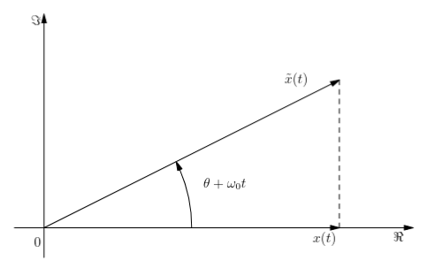

# Senales Notables
## Escalon Unitario
El escalon unitario en tiempo continuo se nota $u(t)$ y se define como
$$u(t) =
 \begin{cases} 
      0 & \text{si } t<0 \\
      a & \text{si } t=0 \\
      1 & \text{si } t>0 \\
   \end{cases}
 $$
En tiempo discreto se define como
$$u(n) = \begin{cases} 
      0 & n\leq0 \\
      1 & n\geq 1 
   \end{cases}
$$
## Rampa Unitaria
Esta se define como $r(t)=tu(t)$ en tiempo continuo, y en tiempo discreto se define como $r(n)=nu(n)$.

# Algebra
En $\mathcal{V} = \{x:\mathcal{I} \to K\}$ se definen suma y producto por escalares. Estas operaciones tienen linealidad, entonces tengo $(\mathcal{V}, +, K, .)$ tiene la estructura de un espacio vectorial de dimension infinita. Con esto puedo comenzar a definir operaciones como el producto de funciones para este espacio vectorial. No lo puedo hacer en cualquiera.

# Desplazamientos y Escalamientos
## Desplazamiento
Para algun $b \in \mathcal{I}$ se define el desplazamiento $d_b: \mathcal{I} \to \mathcal{I}$
$$d_b(t) = t+b$$
Tambien se define la inversa del desplazamiento $d_b^{-1} = d_{-b}$.
Esto me sirve cuando comienzo a componer funciones. Por ejemplo,
$$x \circ d_b(t) = x(t+b) $$
## Escalamiento
$e_{\beta}: \mathcal{I} \to \mathcal{I}$   $e_{\beta}(t)=\beta t$ Ojo con esto. Hay que tener en cuenta que $\beta \neq 0$ y que no necesariamente tiene inversa. Veamos que $e_{\beta}^{-1} = e_{1/\beta}$. Entonces si la senal es discreta, puede pasar que la inversa no caiga dentro del dominio.

Si $\beta < 0$ da vuelta la senal. Puedo pensar que $\beta$ es como un multiplicador de velocidad de paso del tiempo. Cuando es mayor a uno, lo acelera, se acortan los periodos, todo pasa mas rapido, la senal se hace mas corta.

## Conmutabilidad
$$d_a \circ d_b = d_{a+b} $$
$$e_a \circ e_b = e_{ab}$$
$$e_a \circ d_b = d_{ba} \circ e_a$$
$$d_a \circ e_b = e_b \circ d_{a/b}  \text{ si y solo si } \mathcal{I}=\mathbb{R}$$
# Pulso Unitario
Este se puede construir usando escalamientos y desplazamientos, veamos $$\Pi(\frac{t}{\tau}) = u(t+\frac{\tau}{2}) - u(t-\frac{\tau}{2})$$
$$\Pi(\frac{n}{2M}) = u(n+M) - u(n-M-1)$$
Con esto resulta que $\tau$ es el ancho del pulso para el pulso de tiempo continuo. En el pulso de tiempo discreto, el ancho es $2M$, es decir, la funcion vale 1 entre $-M$ y $M$

# La cuestion del periodo
Se define como senal periodica aquella que cumple que $x(t+\tau) = x(t)$. El periodo fundamental $T_0$ es el infimo de todos los periodos. $$T_0: \text{inf}\{\tau > 0 \text{ tal que } \tau \text{ sea periodo.}\}$$
Si $T_0 > 0$ entonces es el periodo fundamental. La definicion para tiempo discreto es la misma, pero hay que tener en cuenta unos detalles. Para numeros naturales, siempre hay una cota inferior perteneciente al conjunto, entonces cuando busco $N_0$ puedo decir que se trata de un minimo y ya no de un infimo. Por ejemplo, si una senal fuera constante, tendria $N_0 = 1$.

Un ejemplo: veamos que $A\cos(2\pi f_0n+\theta)$ es periodica.
$$ \exists N \in \mathbb{N}: x(n+N)=x(n) \forall n$$
$$ A\cos(2\pi f_0(n+N) + \theta) = A\cos(2\pi f_0 n + \theta) $$
$$ A\cos(2\pi f_0 n + \theta + 2 \pi f_0 N) = A\cos(2\pi f_0 n + \theta) $$
$$ A\cos(2\pi f_0 n + \theta)cos(2\pi f_0 N) - A\sin(2\pi f_0 n + \theta)\sin(2\pi f_0 N) = A\cos(2\pi f_0n+\theta) $$
$$ \begin{cases}
\cos(2\pi f_0 N) = 1 \\
\sin(2 \pi f_0 N) = 0 \\
\end{cases} \iff 
2 \pi f_0 N = 2m\pi \text{  } m\in \mathbb{Z} \iff f_0N=m \iff f_0 = \frac{m}{N} \in \mathbb{Q} \\ $$

## Combinacion Lineal de Senales y su Periodicidad
Consideremos una senal $x_1$ con periodo fundamental $T_1$ y otra senal $x_2$ con periodo fundamental $T_2$. Quiero saber cuando $ax_1 + bx_2$ es periodica y con que periodo fundamental lo es.
$$\frac{T_1}{T_2} \in \mathbb{Q} \iff \text{ el periodo fundamental es } T_0 = T_1m_2 = T_2m_1$$
_Nota: esto ultimo es mientras $\frac{T_1}{T_2}=\frac{m_1}{m_2}$, $m_2, m_1$ sean coprimos_

# Representacion Espectral de Senales
Sea $x(t) = A\cos(2 \pi f_0 t + \theta), \omega_0 = 2 \pi f_0, -\pi < \theta \leq \pi, A>0$. Resulta que $x(t) = Re[Ae^{j(\omega_o t + \theta)}]$. De aqui sale que tengo dos fasores; uno estatico y uno dinamico.
El primero de los dos es $Ae^{j\theta}$ y el segundo es $e^{j\omega_0 t}$.

## Diagrama Espectral Unilateral

## Diagrama Espectral Bilateral

# Senales de Potencia y Energia
## Senales de Potencia
Se define la potencia media de una senal en tiempo continuo como $$P = \frac{1}{T} \int^{T}_{0}p(t)dt$$. 
Una senal de potencia es aquella que cumple que $$P_x = \lim_{T \to \infty} \frac{1}{2T} \int^{T}_{-T} |x(t)|^2 dt $$

## Senales de Energia
Son las que cumplen que $$ E_x = \lim_{T \to \infty} \int^T_{-T} |x(t)|^2 dt < \infty$$
