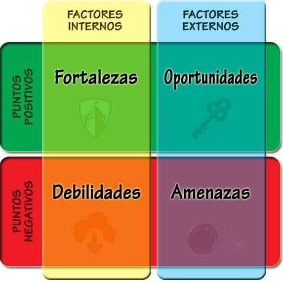
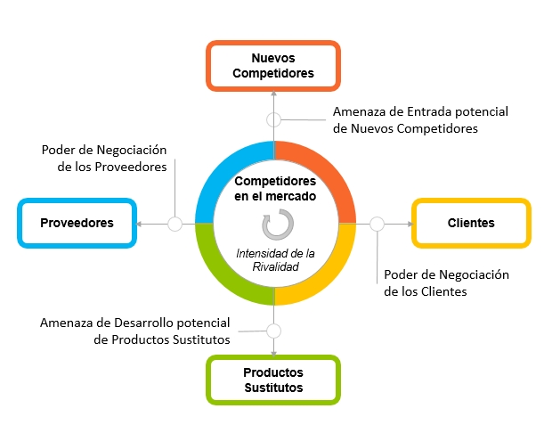

# Que es una empresa?
**Alumnos:** un conjunto de personas y recursos que buscan un benficio economico a traves del desarrollo de una actividad.
**Profesor:** es un sistema, es algo ordenado, que produce un producto o servicio. Tiene un objetivo principal que es ganar valor y/o plata.

# Que es el mercado?
**Alumnos:** Es el espacio en el que se producen intercambios, general de capital por productos.
**Profesor:**  es algo asi como el medioambiente de las empresas. Es el lugar real donde una empresa existe. Es alli donde una empresa va a ver sus reglas, competencia, contexto, proveedores. A quien le vendo, quien me vende.

# Que es la demanda?
**Alumnos:** Cantidad y calidad de bienes, servicios y/o productos buscados en el mercado.
**Profesor:** el interes por un bien o servicio.

# Que es la oferta?
**Alumnos:** Como la demanda, pero los disponibles, los ofertados.
**Profesor:** esta relacionado con la disponibilidad

# Relacion entre oferta y demanda
Estan intimamente relacionadas. Lo ideal es algo en el medio, no quermeos que haya excesivamente mas de una o de otra.

# Producto

# Servicio
Un servicio tiene mas que ver con llevar a cabo una actividad o prestar una accion, no es un objeto tangible.

# Empresa
## Condiciones Basicas
Una mepresa requiere de varias cosas como capital, stakeholders, etc..

## Clasificaciones
### Segun Actividad
Pueden ser primarias, secundarias o terciarias. La actividad primaria es la que extrae un recurso o materia prima (petroleras, por ejemplo). La secundaria es la que principalmente transforma la materia prima en otra cosa (hacer nafta con petroleo). Las tericiarias son las que prestan servicios y llegan al consumidor final con un product final (quiosco, no fabrica ni extrae nada).

### Segun su propiedad
Pueden ser privadas, publicas o mixtas. Esto depende de si son de un particular, del estado o una combinacion.

### Segun su tamano
Por ejemplo, las PyMEs. En Argentina, son importantes porque toman una gran cantidad de empleados.quiosco, no fabrica ni extrae nada

### Segun el numero de propietarios
Esto no tiene mucha magia... Pueden ser unipersonales, de una sociedad o cooperativas.

# Mercado
## Clasificacion
### Segun volumen
Esto compara entre mayoristas y minoristas. De nuevo, no hay nada para agregar a esto.

### Segun el numero de participantes que ofertan
**Competencia Perfecta:** supone la exisencia de muchos oferentes y muchos consumidores. Es donde todos encuentran alguien que les compre y algo que vender.

**Mercado Oligopolico:** manejado por pocos. Empresas de telefonia, de combustibles. Permite el _acartelamiento_, se pueden poner todos de acuerdo y cobrar lo que quieren cobrar.

**Monopolio:** manejado por uno solo. Por ejemplo, las empresas de luz Edenor y Edesur. Segun donde vivas, si o si le pagas a una o a la otra, no tenes opcion.

**Oligopsonio:** son unos pocos los que compran, por los que tienen la capacidad de fijar los precios. Por ejemplo, en Argentina hay muy pocas productoras de leche, entonces los que les venden los tambos no tienen mas opcion que vender al precio que deciden ellas.

**Monopsonio:** esto es mas dificil pero es lo mismo que oligopsonio. Ejemplo: tanques de guerra.

### Segun la regulacion
Regulados vs Desregulados.

# Productividad
Esto se relaciona con minimizar costos, tiempo, etc y maximizar la produccion.

# Eficacia y Eficiencia
**Eficaz:** cumple su proposito

**Eficiente:** lo cumple de la mejor manera

$$\text{EFECTIVIDAD} = \text{ EFICACIA } + \text{ EFICIENCIA}$$

# Estrategia
1. Hacia donde vamos?
2. Donde estamos?
3. Como vamos a llegar?
## Hacia donde vamos?: Mision
Es la razon de ser de la empresa. El motivo por el cual existe. Ha de ser un enunciado simple y preciso. Indica la premisa de valor que se les ofrece a los clientes. Es un elemento fundamental y fundacional de una empresa saber por que existe.
La **vision** es similar pero

El docente jura que estas declaraciones marcan la diferencia a la hora de tomar decisiones y justificar actitudes de la empresa (ponele).

Aerolineas Argentinas tiene como mision conectar al pais con un servicio seguro y confiable, contribuyendo... Mientras tanto, su vision es _ser la empresa elegida como la mejor opcion para volar y trabajar, liderando el desarrollo del mercado..._

## Donde estamos?: analisis FODA/SWOT
**F**ortalezas - **O**portunidades - **D**ebilidades - **A**menazas

Para armar esto de manera correcta, es ventajoso trabajar con factores **PEST** (Political - Economical - Sociocultural - Technological)

## Donde estamos?: Fuerzas de Porter

ngl aca tengo que volver a mirar el powerpoint
[Bibliografia exacta de la catedra](https://www.nueva-iso-9001-2015.com/2020/05/que-es-el-modelo-de-las-5-fuerzas-de-porter-y-como-se-realiza-un-analisis-competitivo-con-este-modelo/)
