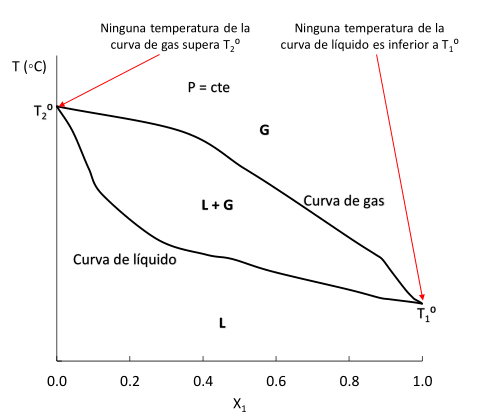

# Diagrama de Destilacion

Como no estamos trabajando con componentes ideals, sabemos que no se va a cumplir la Ley de Raoult.

En la practica se trabaja a presion constante variando la temperatura. De esta manera se pueden separar los componentes de una mezcla donde ambos son volatiles, siempre y cuando sus puntos de ebullicion no sean muy similares.

{width=300px}

