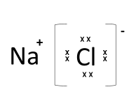
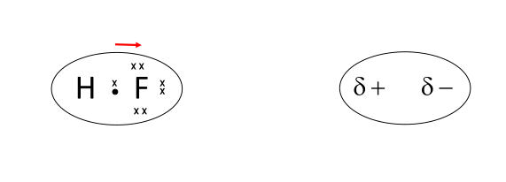
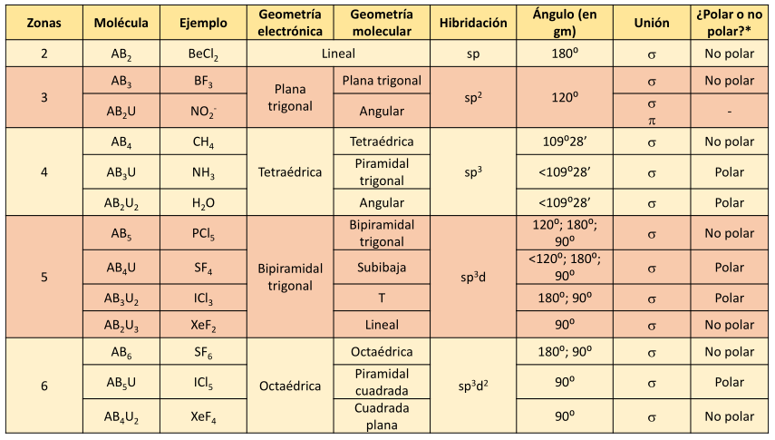

# 1A - Uniones Quimicas

Los atomos realizan uniones entre si por medio de atracciones electrostaticas. Los electrones negativos se ven atraidos por los nucleos positivos. Esta atraccion es compensada por la repulsion entre los nucleos de atomos y de los electrones entre si. Sin embargo, los electrones apantallan los nucleos, es decir, se distribuyen en torno de los mismos de tal manera que resulta una atraccion neta.

## Union Ionica

Se da por fuerzas de atraccion electrostatica entre particulas de cargas opuestas (iones). Un atomo que tiene tendencia a ceder uno o mas electrones los cedera a otro que posee alta capacidad para aceptarlos.

Es importante aclarar que a pesar de que se llame *union*, no se unen, sino que comparten electrones.

#### Ejemplo
Realizar la representacion de la estructura de Lewis para NaCl

Na: $1s^2 2s^2 2p^6 3s^1$

Cl: $1s^2 2s^2 2p^6 3s^2 3p^5$

{width=100px}

Como regla: el atomo que cede electrones busca adoptar la configuracion electronica del gas noble mas cercano que lo precede en la tabla periodica. El atomo que acepta busca lo mismo para el gas noble que lo sucede en la tabla periodica. Esto se conoce como **regla del octeto**.

Nota: no existe la union ionica pura ya que siempre habra una superposicion de orbitales, que le genera un grado de enlace covalente.

## Union Metalica

Los atomos metalicos tienen los electrones de su configuracion electronica externa desocaizados. Esto quiere decir que se pueden mover. Entonces, los iones positivos (cationes) estan rodeados de electrones y se forma una union de tipo metalica entre cationes y electrones.

## Union Covalente

Se comparten pares de electrones que son atraidos por los nucleos de los dos atomos. Se forman moleculas debido a la superposicion de orbitales. Este tipo de union se da entre atomos que poseen una electronegatividad similar. En general, pero no siempre, suelen ser no metales.

Si la suma vectorial de las electronegatividades de las uniones en una molecula es no nula, entonces se trata de una molecula polar. Esto se puede interpretar como que los electrones estan mas tiempo cerca del nucleo del elemento mas electronegativo, generandose un dipolo. El dipolo da origen a un momento dipolar. Este tipo de molecula tiene un cierto grado de enlace ionico.

{width=300px}

# 1B - Enlace Covalente y Geometria Molecular e Ionica

Existen teorias que intentan explicar como se forman los enlaces en los compuestos covalentes y que sirven para identificar la geometria de las moleculas. Estas tres teorias son:

- Teoria de la Repulsion de los Pares de Electrones de Valencia (TRPEV)
    *Los electrones se distribuyen alrededor del atomo central de forma tal que entre ellos se tenga la minima repulsion*
- Teoria del Enlace de Valencia (TEV)
    *Es una teoria de orbitales atomicos. Nos ayuda a entender como se unen los atomos al atomo central. Surge del modelo cuantico.*
- Teoria de Orbitales Moleculares

Vamos a analizar moleculas con un atomo central unido a dos o mas atomos terminales mediante pares de electrones enlazantes. Sobre el atomo central pueden quedar pares de electrones libres. Se habla en terminos de zonas de alta densidad electronica en torno al atomo central.

{width=500px}

# 2B - Fuerzas Intermoleculares
