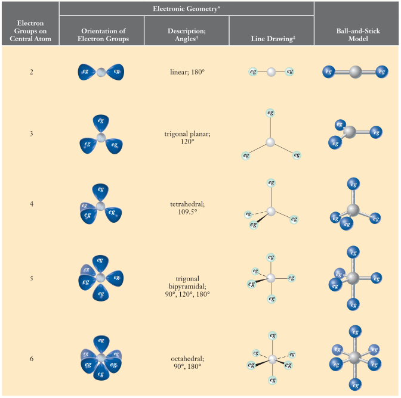
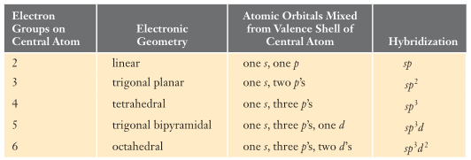
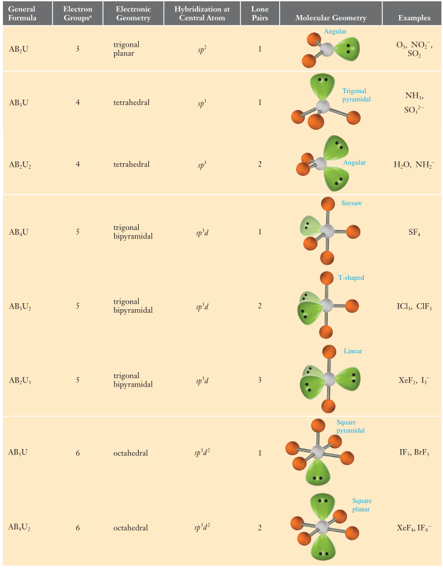
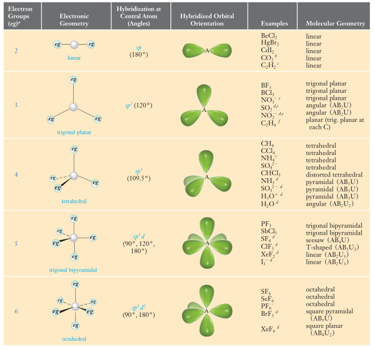

# Estructura Molecular y Teorias de Enlaces Covalentes
Los electrones que intervienen en los enlaces quimicos son los de la capa exterior o capa de valencia. Son los que estan en exceso con respecto al gas noble inmediatamente anterior al elemento en cuestion.
Hay dos teorias en lo que respecta las uniones covalentes. Una de ellas es la _Valence Shell Electron Pair Repulsion Theory (VSEPR)_. Esta apunta a predecir la disposicion espacial de atomos en moleculas poliatomicas. Muestra donde es que ocurren las uniones y donde se encuentran los pares electronicos libres, pero no explica como es que ocurren los enlaces.
Otra teoria es la _Valence Bond Theory (VB)_. Esta describe como es que se dan los enlaces covalentes en terminos de superposicion de orbitales. En esta teoria los orbitales son a menudo combinados o _hibridados_ para formar nuevos orbitales con disposiciones espaciales diferentes. Para entender los enlaces quimicos nos valdremos de ambas teorias.

## Estrategia para analizar cualquier compuesto
 1. Escribir la formula de Lewis para la molecula e identificar el atomo central de la misma.
 2. Contar el numero de centros de alta densidad electronica en el atomo central.
 3. Aplicar la teoria de VSEPR para determinar la geometria electronica.
 4. Usando la formula de Lewis, determinar la disposicion de los atomos en la union asi como la de los pares electronicos libres.
 5. Si hay pares electronicos libres, considerar como su presencia puede modificar la geometria molecular ideal deducida en el paso 4.
 6. Usar la teoria de VB para determinar los orbitales hibridos utilizados por el atomo central. describir la superposicion de estos atomos para formar uniones. Describir los orbitales que contienen pares electronicos libres en la capa de valencia del atomo central.
 7. Si mas de un atomo puede ser identificado como central repetir los pasos 2 a 6 para cada uno.
 8. Cuando todos los atomos centrales de la molecula han sido cubiertos, se puede comenzar a hablar de la polaridad de la misma.

# Valence Shell Electron Pair Repulsion Theory
La idea basica de la teoria VSEPR es ver que se generan fuerzas repulsivas entre cada centro de alta densidad electronica. Estos se disponen alrededor del atomo central de tal manera que las repulsiones o fuerzas repulsivas son minimizadas, esto resulta en la maxima separacion de los centros de alta densidad electronica en torno al atomo central.
La molecula o ion en cuestion sera mas estable cuando estos centros de alta densidad electronica esten lo mas alejados posible. Esta distribucion de centros se conoce como la **geometria electronica**. A continuacion adjunto una tabla que resume las distintas geometrias electronicas segun la cantidad de centros de alta densidad electronica en torno al atomo central.

# Moleculas Polares: Geometria Molecular
Cuando una molecula consiste de mas de dos atomos unidos por uniones polares, debemos considerar, tambien, la disposicion de los dipolos para determinar si la molecula en si es polar. Para esto vamos a usar primero la VSEPR para deducir la geometria molecular y luego determinar la polaridad. Para no gastar demasiados bytes en esta seccion, lo resumo: se tiene que efectuar la suma vectorial de los momentos de los dipolos electricos para determinar el dipolo neto de la molecula. Aun asi, para moleculas mas complejas, no alcanza con esto ya que entran en juego otros efectos, por lo que el analisis de la polaridad en lo que respecta a esta asignatura, sera primitivo.

# Valence Bond Theory
Hasta ahora venimos hablando de uniones covalentes como dos atomos que _comparten electrones_ y ya. Ahora vamos a discutir como es que sucede eso.
Cuando los atomos estan tan cerca como se encuentran en una molecula pueden combinar sus orbitales en la capa de valencia para formar un nuevo conjunto de orbitales a menor energia. Este proceso se conoce como **hybridization** (hibridacion) y los nuevos orbitales se llaman orbitales hibridos. Estos se generan a traves de la superposicion de orbitales de otros atomos para compartir electrones y formar enlaces.
Mas adelante, con los ejemplos y diferentes casos de moleculas, vamos a entrar mas en detalle sobre la hibridacion y los distintos tipos de enlaces que se pueden formar.

A continuacion, una tabla que detalla la hibridacion para las distintas cantidades de centros de alta densidad electronica en torno del atomo central de la molecula.

# Geometrias Electronicas
## Lineal: especies $\text{AB}_2$
Para este caso en particular no hay mucho que decir. Es el clasico. Un ejemplo de este tipo de geometria es el de $\text{BeCl}_2$
En cuanto a la formula de Lewis de  estos compuestos, es bastante directa asi que no voy a entrar en detalle. Lo importante es que el angulo formado por las direcciones de las fuerzas de repulsion en este tipo de geometria es de $180 ^{\circ}$. Moleculas con esta geometria son no polares.
Al tener dos centros de alta densidad electronica, voy a usar el orbital s y un orbital p. Entonces la hibridacion para estos compuestos es de tipo $sp$.

## Trigonal Planar: especies $\text{AB}_3$

... a partir de aca dejo de resumir oprque es todo lo mismo y es mas rapido mirar una table o buscarlo en el Whitten.

