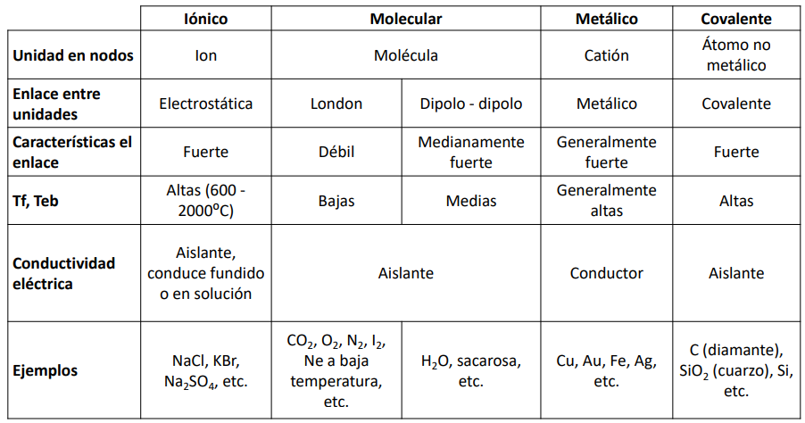

# Intermolecular Forces

Intermolecular forces determine bulk properties, such as the melting points of solids and the boiling points of liquids. Liquids boil when the molecules have enough thermal energy to overcome the intermolecular attractive forces that hold them together.

They are electrostatic in nature. They arise from the interaction between positively and negatively charged species. They are both the sum of attractive and repulsive components.

## Dipole-Dipole Interactions

Polar covalent bonds behave as if the bonded atoms have localized fractinal charges that are equal but opposite. If a molecular is such that the individual bond dipoles do not cancel each other out (i.e. it is polar) then the molecule has a net dipole moment. These molecules tend to align themselves so that the positive end of one dipole is near the negative end of another and vice-versa.

Any arrangment where the positive and negative ends are adjacent will be more stable than when they are head-to-head. Dipole-Dipole interactions are **attractive** intermolecular forces. Becuase each end of a dipole possesses only a fraction of the charge of an electron, these interactions are substantially weaker than the interactions between two ions. These interactions also fall off much more rapidly with increase in distance.

## Puente de Hidrogeno

Es un caso especial de las uniones dipolo-dipolo que se da cuando el H se une a atomos de elementos muy electronegativos como F, O, N. El dipolo que se forma es tan fuerte que se hace la distincion de llamarlo de esta manera. Tienen temperaturas de fusion y ebullicion mas altas que las esperadas.

## London Dispersion Forces

These are the forces that appear in non-polar molecules. Fritz London proposed that temporary fluctuations in the elctron distributions within atoms and nonpolar molecules could result in the formation of short-lived instantaneous dipole moments, which produce attractive forces called London disperion forces between otherwise nonpolar substances.

Este tipo de union se vuelve relevante en las moleculas no polares, ya que no habra dipolos permanentes en ellas. Son mucho mas debiles que las fuerzas dipolo-dipolo. Depende de la cantidad de electrones en la molecula, si hay mas, habra mayor tendencia a formar dipolos. En moleculas mas grandes, con mas electrones, se forman dipolos con mayor polaridad, entonces son mas intensas las fuerzas de London.

## Union Covalente

Esta si es una union quimica. Es muy fuerte, por lo que da lugar a altas temperaturas de fusinon y ebullicion.

# Solidos

## Solidos Amorfos

Las particulas que conforman los solidos amorfos carecen de una estructura ordenada. Muchos solidos amorfos son mezclas de moleculas que no se pueden apilar bien. Son sustancias **isotropicas** (iguales propiedades fisicas en todas las direcciones). Pueden ser formados, por ejemplo, superenfriando un compuesto.

## Solidos Cristalinos

Son particulas perfectamente ordenadas en el espacio segun una red tridismensional de geometria variada. Son **anisotropicos**, lo que quiere decir que no tienen iguales propiedades fisicas en todas las direcciones.

